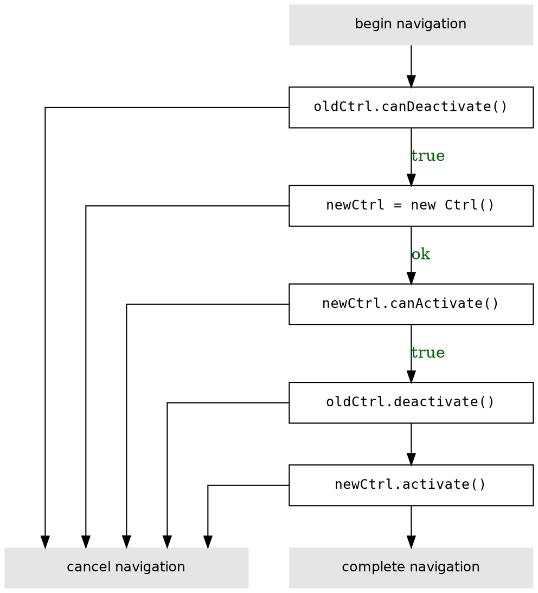

# Lifecycle hooks

There are four main lifecycle hooks: `canActivate`, `activate`, and `canDeactivate`, and `deactivate`.

To understand how this works, let's step through a simple case where a component wants to navigate from one route to another.

## An example

```js
MyController(user, $http) {
  this.user = user;
  this.$http = $http;
  this.userDataPersisted = true;
}

MyController.prototype.updateUserName = function(newName) {
  var self = this;
  this.userDataPersisted = false;
  return this.user.setName(newName).then(function () {
    self.userDataPersisted = true;
  });
};

MyController.prototype.canActivate = function() {
  return this.user.isAdmin;
};

MyController.prototype.activate = function() {
  this.user.downloadBigFiles();
};

MyController.prototype.canDeactivate = function() {
  return this.userDataPersisted;
};
```

## Overview

This is the basic logic that the router uses when determining whether or not to activate




## Handling failure

What happens when a `canActivate` or `canDeactivate` returns `false`?

By default, this stops the navigation entirely.

<!--
TODO: show multiple levels
TODO:
-->


<!--
## Hooks in Multiple levels
TODO: show multi-level
-->
