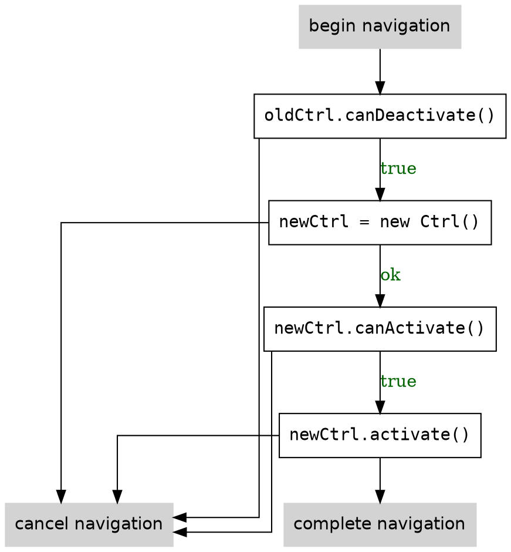

# Getting Started

These are instuctions for starting a new app with the New Router with AngularJS 1.4.

Include `router.es5.js` in your app's `index.html`.


## Project Structure

We're going to organize our code like this, and assume we have a simple HTTP server
that serves files at a path corresponding to their location within the file system.

```
index.html
package.json
components/
├── app/
│   ├── app.html
│   └── app.js
├── phone-detail/
│   ├── phone-detail.html
│   └── phone-detail.js
├── phone-list/
│   ├── phone-list.html
│   └── phone-list.js
node_modules/
└── ...
```

Let's start with the contents of `index.html`:

```html
<!doctype html>
<html lang="en">
<head>
  <meta charset="utf-8">
  <base href="/">
  <title>My app</title>
</head>
<body ng-app="myApp">
  <div router-component="app"></div>

  <script src="/node_modules/angular/angular.js"></script>
  <script src="/dist/router.es5.js"></script>
  <script src="/app/app.js"></script>
</body>
</html>
```


## A component

You might've noticed that we have a directory called `components`.

In Angular 1, a component is a template and a controller.

<!--
<aside>
In Angular 2, the DI system understands how to... .

In Angular 1, we need this component system to hook up child routers.
</aside>
-->

A component's template can have view ports.

A component's controller can have a router.
A component's router tells the component what to put inside the view ports based on configuration.
The configuration maps routes to components for each viewport.

Let's see what this looks like:

`app/app.js`
```html
angular.module('PhoneListController', function (router) {
  router.config([
    {path: '', component: 'detail' }
  ])
});
```

## Nesting Routes

module.controller('PhoneListController', function (router) {
  router.config([
    {path: '', component: 'detail' }
  ])
});


## Lifecycle hooks

There are three main lifecycle hooks: `canActivate`, `activate`, and `canDeactivate`.

To understand how this works, let's step through a simple case where a component wants to navigate from one route to another.


### An example

```js
MyController(user, $http) {
  this.user = user;
  this.$http = $http;
  this.userDataPersisted = true;
}

MyController.prototype.updateUserName = function(newName) {
  var self = this;
  this.userDataPersisted = false;
  return this.user.setName(newName).then(function () {
    self.userDataPersisted = true;
  });
};

MyController.prototype.canActivate = function() {
  return this.user.isAdmin;
};

MyController.prototype.activate = function() {
  this.user.downloadBigFiles();
};

MyController.prototype.canDeactivate = function() {
  return this.userDataPersisted;
};
```

### High level overview

This is the basic logic that the router uses.



<!--
TODO: show multi-level
-->


### Handling failure

What happens when a `canActivate` or `canDeactivate` returns `false`?

By default, this stops the navigation entirely.

<!--
TODO: show multiple levels
TODO:
-->
i


## Multiple Viewports

A component can have multiple viewports:

`multiview.html`
```html
<div class="container">
  <div ng-view-port="left"></div>
  <div ng-view-port="right"></div>
</div>
```

Viewports are named with the `ng-view-port` attribute.

They are then configured like this:

`multiview.js`
```js
router.config([
  { path: '/', components: { left: 'tree', right: 'detail' } }
])
```


## Additional reading

See the `examples/` directory for common recipies.
